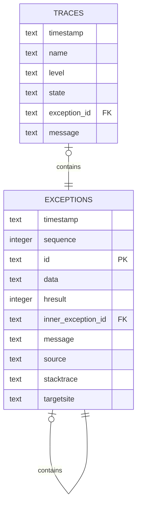

# SQLite Logger

SQLiteLogger is an implementation of `Microsoft.Extensions.Logging.ILogger` that sends log events to a SQLite database.

## Use

Simply add the Provider to the LoggerFactory. See [Logging in C# and .NET](https://learn.microsoft.com/en-us/dotnet/core/extensions/logging) for details and tutorial on the Microsoft-built .NET logging system.

The database file is created if it does not already exist. An existing database may also be used. 

```csharp
using ILoggerFactory loggerFactory =
    LoggerFactory.Create(builder =>
    {
        builder.AddSqliteLogger(options =>
        {
            options.FilePath = "logs.db";
        });
    });
```

If desired, enable the in-memory queue setting the `SqliteLoggerConfiguration.UseQueue` option.

When the in-memory queue is disabled, all log messages are sent to the on-disk database. This means that calls to `ILogger.Log(...)` block until SQLite finishes writing the new rows. This time can be significant compared to other loggers. 

The in-memory queue causes the library to create an additional SQLite database (which is, of course, in-memory). Calls to `ILogger.Log(...)` write to this database instead of the on-disk database, which completes quickly. All entries in the in-memory database are periodically (on a timer) copied to the on-disk version. 

The benefit of enabling the in-memory queue is less time spent in calls to the logging system, but there is a risk of losing the most recent log messages if the app crashes.

## Table schema

All logging messages are written to the `traces` table. `State` data is serialized and stored as JSON. 

Exceptions are written to the `exceptions` table. A GUID is generated for each exception and acts as a primary key and is used as a reference in both the originating trace entry (in the `exception_id` field) and other exception entries (in the `inner_exception_id`).

SQLite3 commands:


    CREATE TABLE IF NOT EXISTS traces (
        timestamp TEXT NOT NULL,
        name TEXT NOT NULL, 
        level TEXT NOT NULL, 
        state TEXT, 
        exception_id TEXT REFERENCES exceptions(id) ON DELETE CASCADE ON UPDATE CASCADE, 
        message TEXT
    );

    CREATE TABLE IF NOT EXISTS exceptions (
        timestamp TEXT NOT NULL, 
        sequence INTEGER NOT NULL, 
        id TEXT PRIMARY KEY, 
        data TEXT, 
        hresult INTEGER, 
        inner_exception_id TEXT REFERENCES exceptions(id) ON DELETE CASCADE ON UPDATE CASCADE, 
        message TEXT NOT NULL,
        source TEXT,
        stacktrace TEXT, 
        targetsite TEXT"
    );



The `exceptions. Data` field represents the [`Exception.Data`](https://learn.microsoft.com/en-us/dotnet/api/system.exception.data) field serialized as JSON. The field takes any type of object as a key or a value, and this library will attempt to serialize it as a string. 

## Performance

Benchmarks are always tricky, and this library has not seen thorough analysis. But, even quick benchmarks can give some feel for configuration variations.

Below are the results of the BenchmarkDotNet-based [microbenchmark](Benchmarks/) at commit 2fbf7b3b2d.

    BenchmarkDotNet v0.13.10, Windows 11 (10.0.22631.2715/23H2/2023Update/SunValley3)
    Intel Core i7-8750H CPU 2.20GHz (Coffee Lake), 1 CPU, 12 logical and 6 physical cores
    .NET SDK 8.0.100
    [Host]     : .NET 8.0.0 (8.0.23.53103), X64 RyuJIT AVX2
    Job-DDZKBP : .NET 8.0.0 (8.0.23.53103), X64 RyuJIT AVX2

    Runtime=.NET 8.0  Toolchain=net8.0

| Method        | UseQueue | Mean        | Error     | StdDev    | Median      | Ratio | RatioSD | Gen0   | Gen1   | Allocated | Alloc Ratio |
|-------------- |--------- |------------:|----------:|----------:|------------:|------:|--------:|-------:|-------:|----------:|------------:|
| SqliteLogger  | False    | 3,697.61 us | 66.686 us | 91.280 us | 3,691.10 us | 11.86 |    0.41 |      - |      - |    3781 B |       31.51 |
| ConsoleLogger | False    |   311.72 us |  6.066 us |  8.700 us |   308.67 us |  1.00 |    0.00 |      - |      - |     120 B |        1.00 |
|               |          |             |           |           |             |       |         |        |        |           |             |
| SqliteLogger  | True     |    16.51 us |  2.025 us |  5.938 us |    12.75 us |  0.05 |    0.02 | 0.7935 | 0.0610 |    3761 B |       31.34 |
| ConsoleLogger | True     |   336.51 us |  8.276 us | 24.401 us |   333.27 us |  1.00 |    0.00 |      - |      - |     120 B |        1.00 |